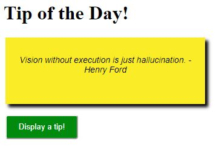

<figure>
  
</figure>

<h1> Description </h1>

Program for display a tip from a list. The tip is chosen randomized and will never repeat yourself until the end of the list.

The main code is the file <code>display-tip.js</code> where one function have the responsability of listen the "click" event and trigger others 4 functions (file: js/functions):

<ul>
  <li>checkNum.js = call the function "randomGenerator" (to generate a random number) and check if the random number wasn't repeated.</li>
  <li>showTip.js = display the tip;</li>
  <li>saveLocalStorage.js = save the random number in local storage;</li>
  <li>clearLocalStorage.js = clear the local storage when all the datas in the file tip.js were displayed.</li>
</ul>
